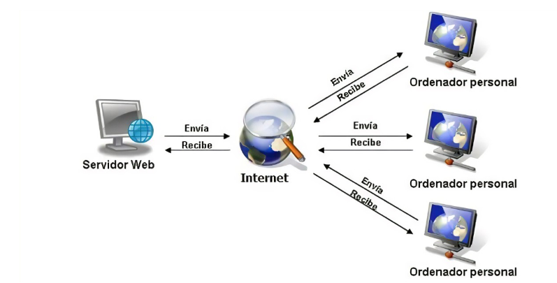

# 0373_A2_santiagogiraldo
## Evaluación inicial
1. ¿Qué es una página web?

    Es un pagina digital que se visualiza en un navegador y contiene texto, imágenes, y enlaces, formando parte de un sitio web.

2. ¿Qué es un servidor web?

    Es el lugar donde se almacenan las paginas web y donde hay que accesder para modificar las paginas.

3. ¿Qué son los lenguajes de marcas? ¿Cuántos conoces?. 

    Los lenguajes de marcas son los que estructuran las paginas web y funcionan a base de etiquetas. Eestos son los que conozco.

    | Nombre    | Enlace a documentación   | 
    |----------------|:------------:|
    |HTML   |[HTML](https://developer.mozilla.org/en-US/docs/Web/HTML)| 
    |XML    | [XML](https://www.w3.org/XML/)|
    |XHTML  | [XHTML](https://www.w3.org/TR/xhtml1/) |
    |SVG    | [SVG](https://www.w3.org/Graphics/SVG/) |

4. ¿Qué es HTML ? ¿Sabes cómo se estructura?

    HTML es el lenguaje de marcas que se utiliza para crear y estructurar páginas web.

    Con este lenguaje de marcas se puede estructurar el contenido de un sitio web utilizando etiquetas, las cuales indican cómo se deben de mostrar los elementos en el navegador.

    ```
    <!DOCTYPE html>
    <html lang="en">
    <head>
        <meta charset="UTF-8">
        <meta http-equiv="X-UA-Compatible" content="IE=edge">
        <meta name="viewport" content="width=device-width, initial-scale=1.0">
        <title>Document</title>
    </head>
    <body>
    </body>
    </html> 
    ```
    
    __*Figura 1: Estructura de código HTML*__
    
5. ¿Qué es CSS?

    El CSS es el lenguaje que se utliza para definir y aplicar estilos a documentos HTML, controla la apariencia visual de las páginas web. 
    CSS permite cambiar cómo se deben ver los elementos de una página HTML, como colores, fuentes, márgenes, alineación, y más.

6. ¿Sabes cómo funciona un navegador web? Describe brevemente el proceso que se sigue para visualizar una página web.:

    Desde un navegador web accedes al link de una paguna web que se conecta con el servidor donde esta hosteado y te da acceso a el.

    

    __*Figura 2: Esquema de peticiones HTML*__